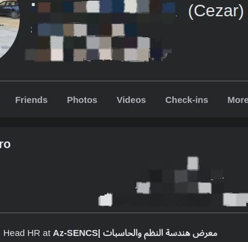

# Save the Day
**Difficulty:** Easy  
**Category:** OSINT  

## Challenge Description

WHO hacked Az-SENCS?

The reconnaissance team has discovered that this was an internal attack. The attacker misused their position within Az-SENCS to carry out the hack. Your task is to identify the **attacker** and it's **position**  within the organization.

---

Solution

1. Search for posts or comments related to hacking activities.
2. Explore mentions and analyze the context to identify the attacker.
3. The attacker is **Cezar**, and their position is **Head HR**.
- **Image:**  
    
  *(Analyze this image for potential clues.)*

**Flag:**  
`AzCTF{Cezar}`

`AzCTF{Head_HR}`

