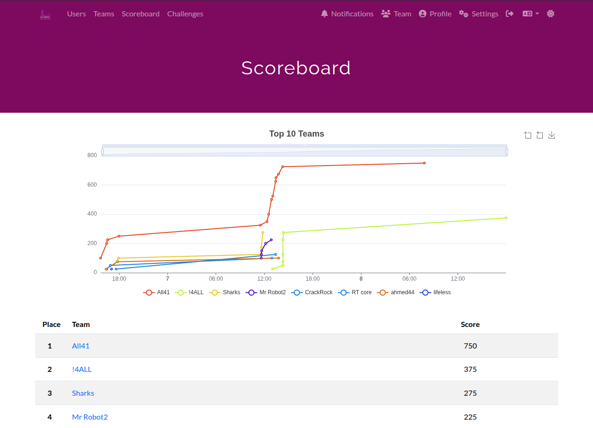

# AzCTF - 15 Challenges

Welcome to the AzCTF Challenge Repository!
This repository contains a variety of Capture The Flag (CTF) challenges across multiple categories, designed to test and improve your skills in cybersecurity, reverse engineering, cryptography, forensics, OSINT, steganography, and web security.

This CTF was proudly introduced during the Az-SENCS Expo for the first time by Az-SENCS 15 Vice-President, Saleh Diaa Ahmed, as part of our initiative to promote hands-on cybersecurity experience within the student community.

<p align="center">
  
</p>
<p align="center">
    
</p>


---

## 📁 Repository Structure

Cryptography/ Forensics/ Network/ OSINT/ Steganography/ Web/ tests/

 Each main directory contains subfolders for individual challenges.


---

## 🏁 Challenge Categories

- **Cryptography**: Classic and modern crypto puzzles, XOR, AES, and more.
- **Forensics**: Memory dumps, malware analysis, intrusion events.
- **Network**: Packet analysis, protocol reverse engineering.
- **OSINT**: Open-source intelligence and investigation tasks.
- **Steganography**: Hidden data in images, files, and more.
- **Web**: Web application security and exploitation.

---

## 🚩 How to Play

1. **Choose a challenge** from any category.
2. **Read the README.md** inside the challenge folder for instructions and hints.
3. **Solve the challenge** using your skills and tools.
4. **Submit the flag** in the format: `AzCTF{...}`

---

## 📝 Example Challenge Structure

Cryptography/ Forensics/ Network/ OSINT/ Steganography/ Web/
```text
Cryptography/What is my type/
                            ├── challenge.c
                            ├── challenge # Compiled binary (if applicable)
                            ├── README.md # Challenge description and hints
                            ├── solution.py # (Optional) Solution script
                            ├── temp.txt # (Optional) Notes/hints
```
---

## 💡 Hints & Solutions

- Some challenges include progressive hints in their README or separate hint files.
- Writeups may be provided for learning purposes from the CTF team.

---

## 👥 Meet Our Team

AzCTF is created and maintained by a passionate group of cybersecurity enthusiasts, educators, and CTF players. Our goal is to provide high-quality, educational challenges for learners of all levels.

**Core Contributors:**
- [0xSA7](https://www.linkedin.com/in/saleh-diaa-ahmed) -- Founder & Challenge Author
- [Hizat](https://www.linkedin.com/in/ibrahim-ezzat-4b21a8234) -- Deployment & Support
- [GERR4Y](https://www.linkedin.com/in/%D8%A2%D9%8A%D8%A9-%D8%A3%D9%8A%D9%85%D9%86-gerr4y-38a76b28a/) -- OSINT Challenge Author
- [Basmala Osama](https://www.linkedin.com/in/basmala-osama) – Web Challenge Author

We welcome new contributors! If you'd like to join the team or help improve the repository, check out [0xSA7](https://www.linkedin.com/in/saleh-diaa-ahmed).

---

## ⚠️ Disclaimer

All challenges are for educational purposes only. Do not use these techniques on systems you do not own or have explicit permission to test.

---

Happy hacking! 🚩
